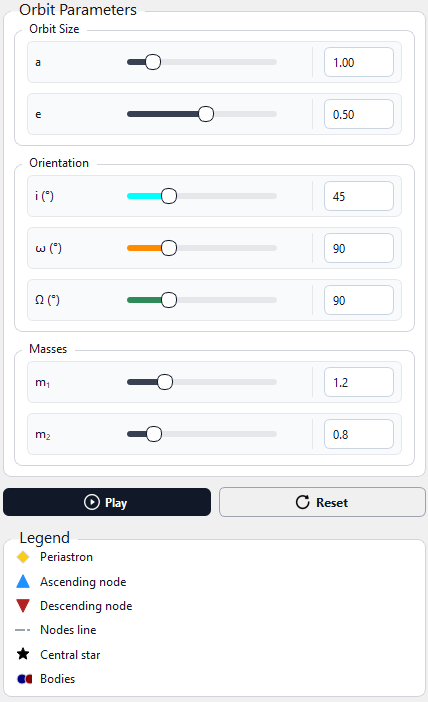

# orbel

<i>**orbel** is a Python program designed to help understand orbital elements by visualising relative and absolute Keplerian orbits in both 3D and 2D.</i>  

---

It was originally created during my master's thesis work on astrometry, starting as a simple tool to explore orbital dynamics, and later evolved into a complete program for educational and research purposes. During my studies, I noticed that both I and many other students struggled to fully understand these elements in lectures and online resources, and found it difficult to visualise them in space. This motivated me to develop this program.


##  Features
- Visualisation of relative and absolute orbits
- 3D orbit geometry and sky-plane projection views
- Customisable orbital parameters via interactive sliders
- Bodies move according to Kepler's laws of planetary motion 
- Supports both educational use and research presentations

---


##  Screenshots

### Relative Orbit


### Absolute Orbit


### Orbital Parameters



---

##  Running the Program
Run the following command in the project directory:
```bash
python orbel.py
```


## Contact

If you have ideas or suggestions for improving orbel, feel free to reach out:
efurkanakar@gmail.com


## License
This project is licensed under the Apache License 2.0 - see the [LICENSE](LICENSE) file for details.
